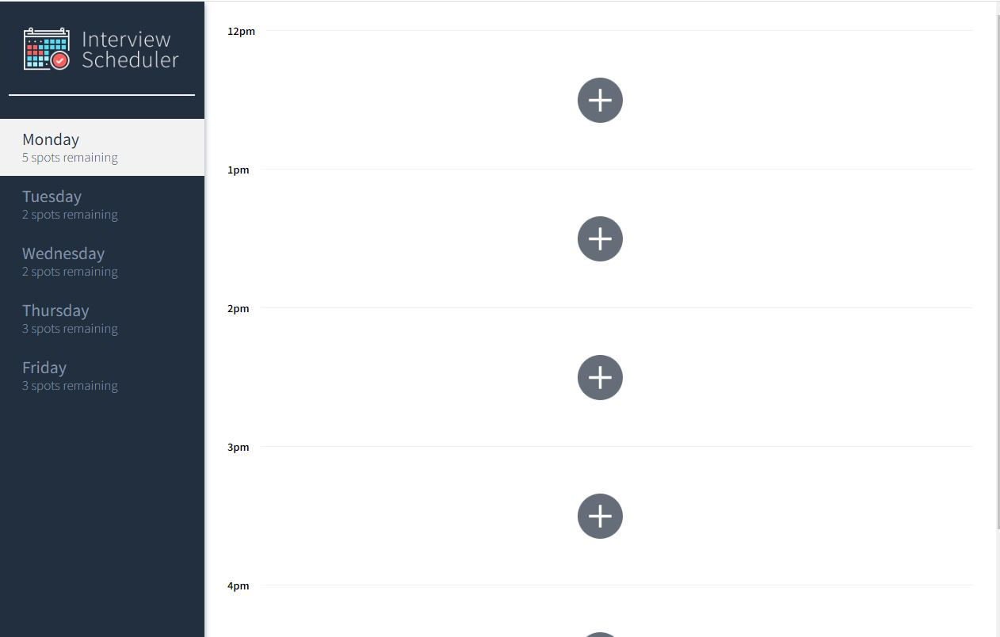
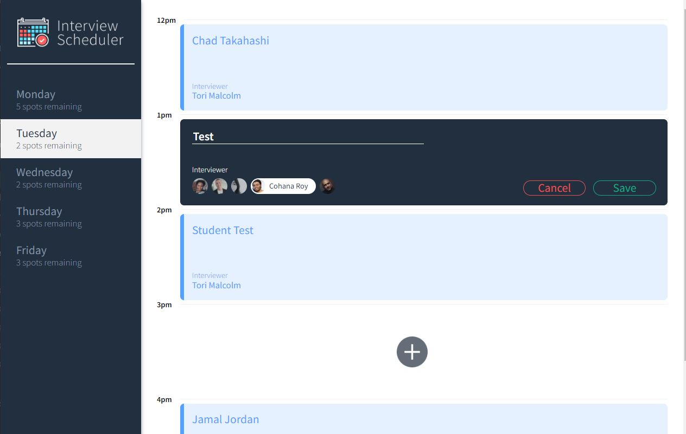
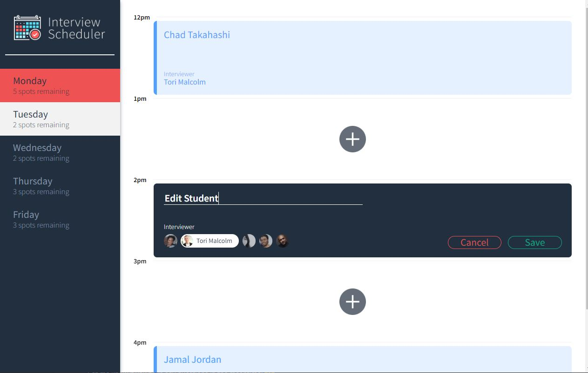
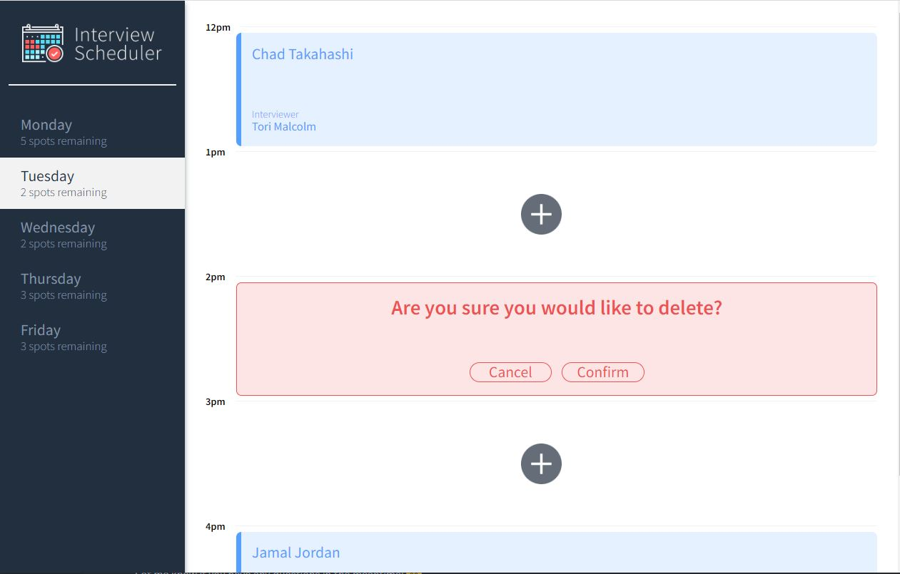
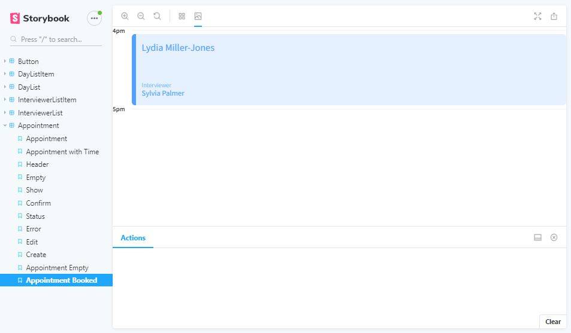
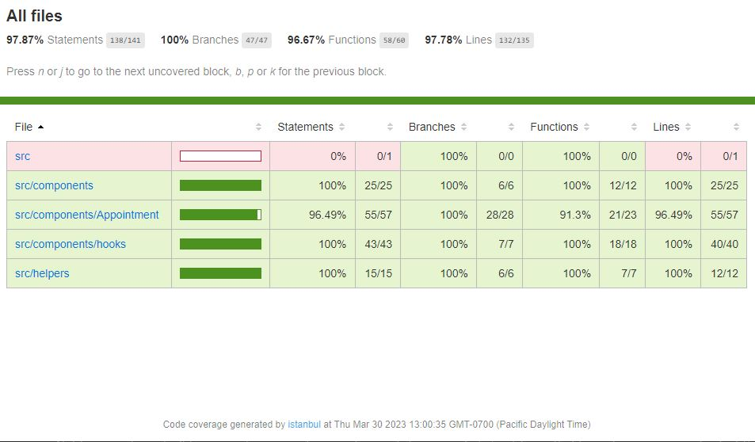
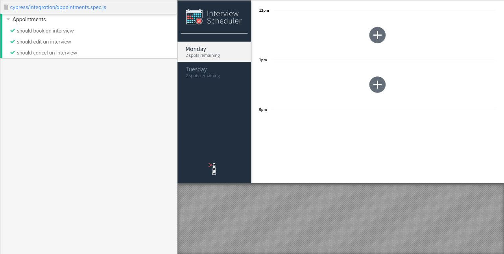

# Interview Scheduler

Interview Scheduler is a React app that allows you to book, edit or cancel appointments.  

## Final Product
### App Overview

### Test results

## Dependencies

- Node.js
- Express
- EJS
- bcryptjs
- cookie-session

## Getting Started

- Install all dependencies (using the `npm install` command).
- Run the development web server using the `node express_server.js` command.
- Input localhost:8080 on your browser.

## Functions of TinyApp

1. Register/Login
2. Create New Links
3. Edit & Delete Short Links
4. Use the Short URL